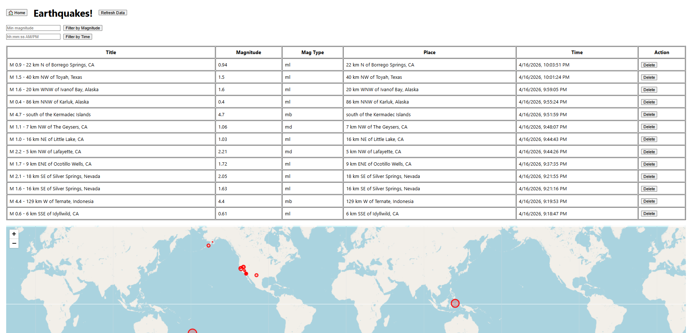

# Earthquake Dashboard

A full-stack web application for fetching, storing and visualizing real-time earthquake data from the USGS API.

## Tech Stack
- **Backend:** Java, Spring Boot, PostgreSQL
- **Frontend:** React, Leaflet.js

## Project Structure
earthquake/

├── earthquake_back/Earthquake  # Spring Boot backend

└── earthquake_front/earthquake-frontend  # React frontend

## Backend Setup
1. Install Java 17+ and Maven
2. Install PostgreSQL and create a database called `earthquake_db`
3. Navigate to `earthquake_back/Earthquake`
4. Configure `src/main/resources/application.properties`:

  #### spring.datasource.url=jdbc:postgresql://localhost:5432/earthquake_db
  #### spring.datasource.username=your_username
  #### spring.datasource.password=your_password
5. Run the application

### Backend runs on:  `http://localhost:8080`

## Frontend Setup
1. Install Node.js
2. Navigate to `earthquake_front/earthquake-frontend`
3. Run:
   
   #### npm install
   #### npm install axios
   #### npm start
Frontend runs on `http://localhost:3000`

## API Endpoints
- `GET /earthquakes/get` - Fetch fresh data from USGS and store
- `GET /earthquakes` - Get all stored earthquakes
- `GET /earthquakes/filter/magnitude?minValue=2.0` - Filter by magnitude
- `GET /earthquakes/filter/after?time=1234567890` - Filter by time
- `DELETE /earthquakes/{id}` - Delete specific earthquake

## Features
- Fetches real-time earthquake data from USGS API
- Filters earthquakes by magnitude and time
- Map visualization with circle markers scaled by magnitude
- Delete individual earthquake records
- **Home button** - Loads current data from the database without calling the USGS API
- **Refresh button** - Fetches fresh data from the USGS API, updates the database and reloads the view

## Assumptions
- Earthquake data is fetched from the USGS last hour endpoint
- All existing records are deleted before inserting new data to avoid duplicates
- Time filter uses unix timestamps in milliseconds
- Magnitude filter uses greater than or equal comparison
- Time filter uses greater than or equal comparison

## Optional Improvements Implemented
- Map visualization using Leaflet.js with circle markers scaled by magnitude
- Delete individual earthquake records
- Global exception handling for all API errors
- Environment-based configuration for sensitive credentials
- Removed hardcoded magnitude check for 2 and replaced it with generic method

## Preview

